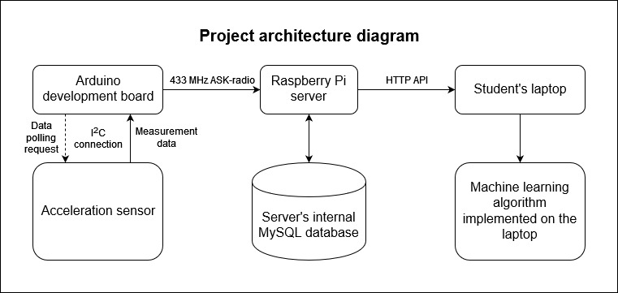
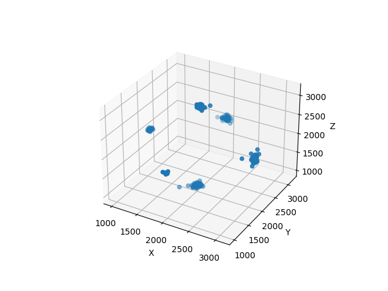
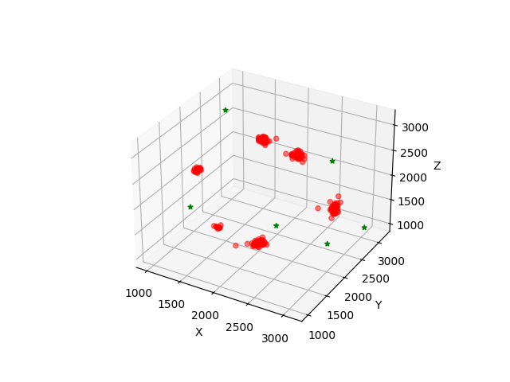
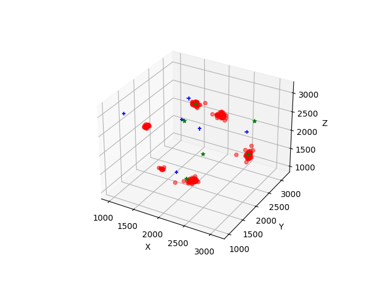
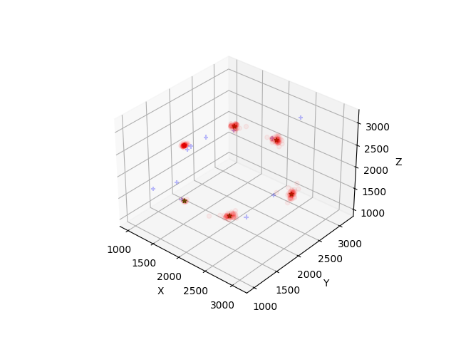
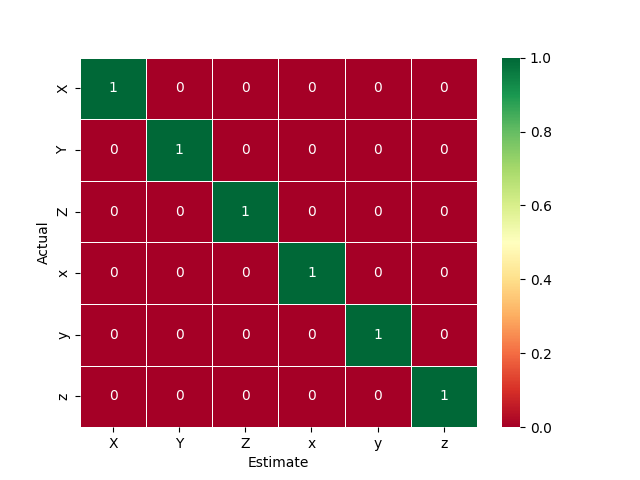
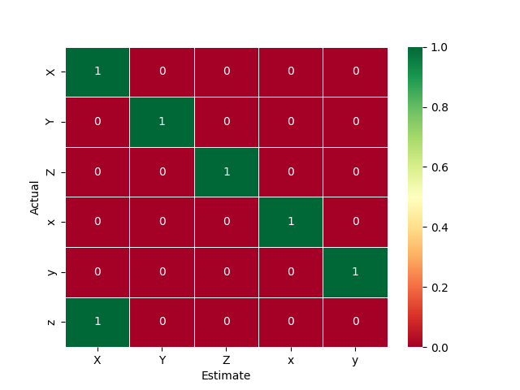

# TVT-project-sg7
TVT21SPL Autumn 2022 application project

## Project description
In this project an Arduino development board (devboard), an accelerometer, a Raspberry Pi, and a Python TCP client will be used to train a machine learning algorithm.
Once this algorithm is trained, it will be ported to C++, and finally on the Arduino to categorize measurements from the accelerometer.

## Setup
### Arduino
In this project, an Arduino Uno embedded development board based on the ATmega328 microcontroller will be used.
Initially the Arduino will be connected both to an accelerometer and an RF transceiver system.
It will read values from the accelerometer, and then transmit them to the Raspberry Pi.
The data will be transmitted through the RF transceiver using the `RadioHead` library developed by Airspayce Pty Ltd.
Once the algorithm has been trained by the transmitted data, the RF transceiver will no longer be needed.
The system will categorize the accelerometer's readings to estimate its orientation, and send its estimate to the laptop using a virtual serial port.
These estimates will be compared to the true orientation, and a confusion matrix will be plotted from these values.

### Raspberry Pi
This part of the project has been set up by the teacher(s), and consists of a Raspberry Pi with an RF transceiver system connected via a virtual serial port.
Its purpose is to function as an IoT router, storing the received accelerometer data in an internal MySQL database.
The database's contents can be read by a computer over TCP with a HTTP API.

### TCP client
The client will be written in Python, and operated on the student's laptop.
The data read by the client will then be parsed and prepared for use for machine learning.

## K-means algorithm explained
The algorithm's purpose is to find the centroid (arithmetic mean of data points) in each cluster. In this situation, there is one cluster for each axis from the "center" (2048, 2048, 2048). These are -X, +X, -Y, +Y, -Z, and +Z. Around each one of these centroids is a cluster of data points, each representing one measurement made by the Arduino setup.

The algorithm works as follows:
### Step 1:
The source data is imported and formatted to a useful format:

### Step 2:
The algorithm generates K random centroids, where K is the desired centroid count. In this case we know there are 6, so we will generate 6 centroids.

### Step 3:
With each iteration the randomized centroids get closer to the true centroids of each cluster.

### Step 4:
The previous step is repeated until the centroids' coordinates do not change, at which point we have the finished centroids.

## Comparing K-means to neural networks
In addition to the K-means algorithm, a solution based on a neural network was also tested.
The neural algorithm was first developed and trained in Python using the Tensorflow machine learning library.
After training, the network's weights were exported and the trained algorithm was reimplemented in C++ in preparation for being ported to the Arduino devboard.
This process has led to the following observations:

### Development
Initial development went faster with the neural network -based approach, due to the availability of readily made and well documented libraries, such as Tensorflow. In contrast to this, the K-means algorithm had to be written from scratch.

However, when the algorithms needed to be ported to C++, the K-means approach proved to have far superior code portability. In addition to changing the test point reading method from user input to sensor readings, the only notable changes needed were related to the two languages' differing syntaxes.
All of these also needed to be done for the neural algorithm, in addition to also having to remake the code from scratch. This is because the original python code used the Tensorflow library, which is not feasible in the eventual Arduino-based implementation due to its memory footprint.
This process ended up taking most of the neural algorithm's development time, as a neural network is much more difficult to code from scratch than one based on k-means.

### Performance
When it comes to performance, on a desktop environment without debugging tools the difference is only noticable during training.
During training the K-means algorithm was fully trained within a few iterations, which is massively faster than the hundreds of iterations needed by the neural network.

In addition to the difference in training, the K-means algorithm proved far superior when implemented on the Arduino development environment.
While both algorithms had similar flash memory footprints (10030 bytes vs 7776 bytes for the neural and k-means algorithms, respectively), their RAM use was vastly differing. While the k-means algorithm only used 508 bytes of RAM, the neural network required 1630 bytes, meaning a treefold increase of RAM usage. This is largely due to the neural algorithm's dependance on floating point numbers, which each require 4 bytes of memory.

Additionally, the ATmega328 lacks an FPU, which specializes in floating point numbers. This leads to the system requiring floating point emulation, which is much slower than simple arithmetic operations with the integers used by k-means. This results in a massive speed difference on any system without an FPU. While the k-means algorithm was near immediate in its solutions, the neural network required nearly a second for each solution to finish.
While the neural network could be rewritten to not require floating point numbers, this would require large amounts of development time.

### Accuracy
The k-means algorithm managed the same performance in both the desktop and embedded environments, achieving a 149/149 (100%) success rate.

Meanwhile the neural network was left unfinished due to time constraints from the project's schedule. As a result, it only managed a 125/150 (~83%) success rate. 

### Conclusion
When it comes to this project, where the target environment is on a low power embedded system, the K-means algorithm is easily the superior choice.
A neural network is simply too resource intensive for such a use case, and is instead better suited for systems with higher performing hardware.

## Additional goals
Various other pieces of software were tested during this project, which were not necessarily used in the project itself. These are:
- Setting up password-free login to a remote server with an ed25519 key
- Apache
- PHP
- Wireshark
- Netfilter firewall
- Tailscale VPN
- Ansible
- Thunder client
- OpenALPR

The familiarity with these pieces of software will likely be useful in future projects, where the knowledge will speed up development.
